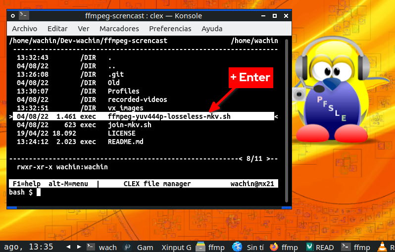
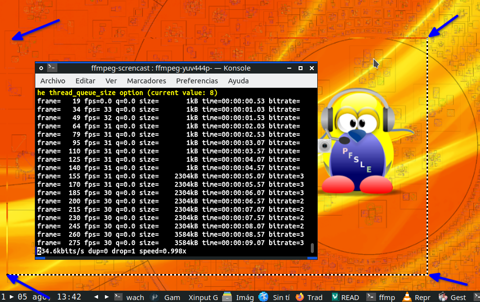
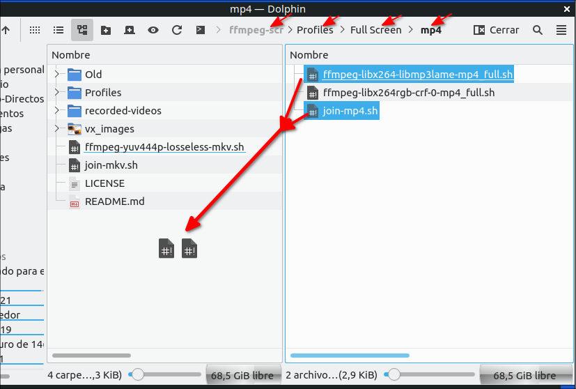
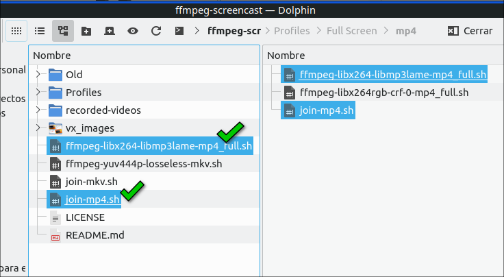
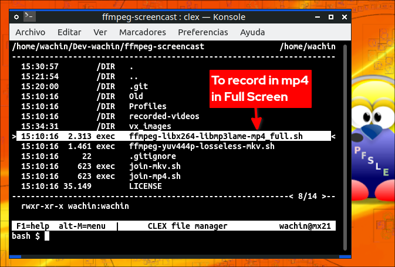

# ffmpeg-screencast
Screencast with ffmpeg with pause option


I had this idea because I saw the following abandoned project:

[https://github.com/raviraa/ffmpegui](https://github.com/raviraa/ffmpegui)

# This is how it looks
The folow screenshot is the Konsole terminal with the Clex command line File Manager inside:



and working with record the screen in a rectangle of 854x480:



this rectangle can be moved around the screen to capture what matters most to you

## Features
- Record rectangle
- Follow mouse
- Record in format: mkv
- Record in format: mp4 (it is necessary to paste the corresponding profile inside the folder 🗀 Profiles)
- Record in Full Screen (it is necessary to paste the corresponding profile iside the folder 🗀 Profiles)

# Dependencies

```
sudo apt install ffmpeg git clex
```

I suggest to use the Clex File Manager for command line usage, but you can also use: "nnn" or some terminal such as: xfce4-terminal, gnome-terminal, konsole, tilix, qterminal, etc, etc

# Installation

```
git clone https://github.com/wachin/ffmpeg-screencast
```

You must enter from a terminal into the cloned repository:

```
cd ffmpeg-screencast
```

write in the terminal and hit Enter:

    clex

The first time you use clex you should configure it, hit Enter some times for that, follow instructions and it will be ready to use

## Screencast
Under clex first get on top of the script:

<span><mark>→ ffmpeg-yuv444p-losseless-mkv.sh</mark></span>

and hit Enter twice and it will start to record the screen in a box of 854x480 pixels

to stop with:

⌨  Ctrl + C

To record another video repeat the process.

## Join videos
To join the videos get on top of the script:

<span><mark>→ join-mkv.sh</mark></span> 

and hit Enter twice, and wait a bit, the videos will be joined into the folder:

🗀 recorded-videos

if for some reason you need the initial videos they will be in the folder:

🗀 Old

## To use it with a terminal
To use with some Linux terminal, just write the name of the script  and execute with ENTER like:

**Screencast**

    ./ffmpeg-yuv444p-losseless-mkv.sh
    
You can help with tab to [autocomplete commands](https://www.computerhope.com/tips/tip176.htm)

**Join videos**

    ./join-mkv.sh 


**Other FFmpeg options**
I have made this program so that it records with the videos in the mkv format because it gave me the best results, but you can record with mp4 by copying some of the profiles that are in the folder:

🗀 Profiles

where there are also profiles to record in full screen, example:



and that is:



then run clex in a terminal in the main path and see:



hit Enter end the recorder are into the full screen

# The beggining
First I started doing some tutorials on how to record the screen with ffmpeg from the terminal. In Spanish:

**[Screencast] Grabar pantalla con FFmpeg 4.2 + seguir cursor + mostrar cursor + grabar rectangulo de 480p**
https://facilitarelsoftwarelibre.blogspot.com/2021/03/screencast-ffmpeg-follow-mouse-linux.html


